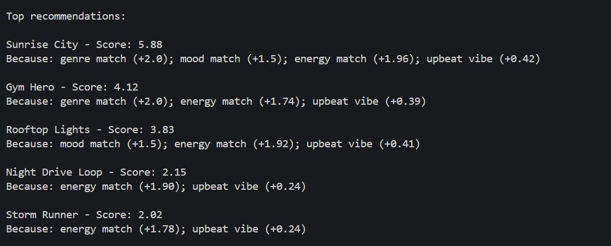
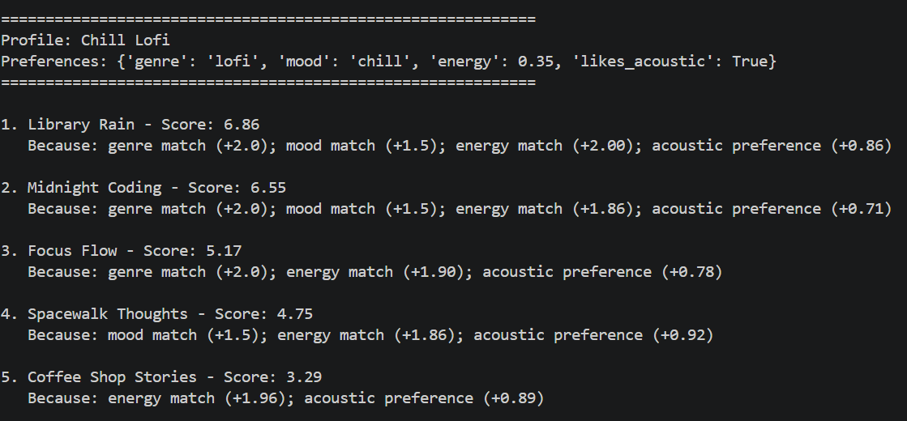
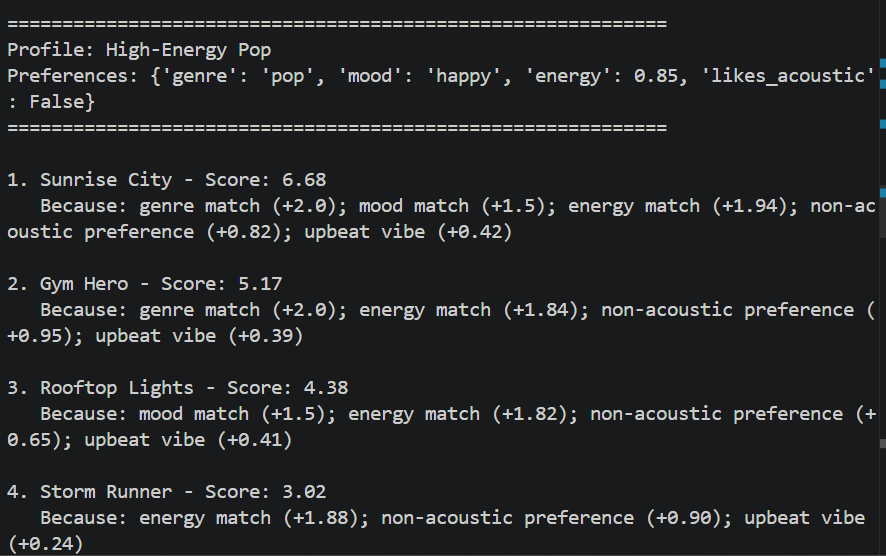
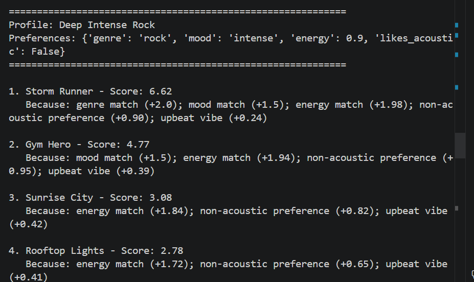

# 🎵 Music Recommender Simulation

## Project Summary

In this project you will build and explain a small music recommender system.

Your goal is to:

- Represent songs and a user "taste profile" as data
- Design a scoring rule that turns that data into recommendations
- Evaluate what your system gets right and wrong
- Reflect on how this mirrors real world AI recommenders

Replace this paragraph with your own summary of what your version does.

---

## How The System Works

Explain your design in plain language.

Some prompts to answer:

- What features does each `Song` use in your system
  - For example: genre, mood, energy, tempo
- What information does your `UserProfile` store
- How does your `Recommender` compute a score for each song
- How do you choose which songs to recommend

You can include a simple diagram or bullet list if helpful.

### Workflow Table

| Step | Stage | What Happens | Key Function(s) |
|---|---|---|---|
| 1 | Start Program | The app starts in `main()` and prepares to run test user profiles. | `main` |
| 2 | Load Dataset | Song rows are read from `data/songs.csv` and converted into song dictionaries. | `load_songs` |
| 3 | Build User Profile | A profile's preferences (genre, mood, energy, acoustic preference) are selected. | `profiles` list in `main.py` |
| 4 | Score Each Song | Every song is compared to the user profile using weighted rules (genre, mood, energy, acousticness, valence). | `score_song` |
| 5 | Rank Songs | All `(song, score, reasons)` results are sorted from highest to lowest score. | `recommend_songs` |
| 6 | Select Top K | Only the top `k` songs are kept as recommendations. | `recommend_songs(..., k=5)` |
| 7 | Explain Results | Recommendation reasons are formatted and printed for the user. | `print_recommendations` |

The system work by giving a score to each song based on how well it matches the user
First Song Features
Each Song includes both categorical and numeric features:
Categorical:
genre (ex: Pop, Rock)
mood (ex: Upbeat, Chill)
Numeric (scaled 0 → 1):
energy
danceability
valence (how happy/sad a song feels)

I use both because genre/mood capture the overall vibe, while numeric features give more detailed control.

Next the UserProfile stores:

Preferred genre and mood
Target values for numeric features (ex: energy = 0.8)
Weights for each feature (how important each one is)

For example, I’d usually give genre a higher weight than mood, since users are more likely to reject songs outside their preferred genre.

For each song, I compute how close it is to the user’s preferences. So the closer the song is to the user’s target, the higher the score. Then I combine everything into one score:
g = genre match (0 or 1)
m = mood match (0 or 1)
closeness for each numeric feature

This gives me a single compatibility score for each song.

Once every song has a score return the top N songs

Example of song recommendation output 

---

## Test Results with Diverse Profiles



## Getting Started

### Setup


1. Create a virtual environment (optional but recommended):

   ```bash
   python -m venv .venv
   source .venv/bin/activate      # Mac or Linux
   .venv\Scripts\activate         # Windows

2. Install dependencies

```bash
pip install -r requirements.txt
```

3. Run the app:

```bash
python -m src.main
```

### Running Tests

Run the starter tests with:

```bash
pytest
```

You can add more tests in `tests/test_recommender.py`.

---

## Experiments You Tried

Use this section to document the experiments you ran. For example:

- What happened when you changed the weight on genre from 2.0 to 0.5
- What happened when you added tempo or valence to the score
- How did your system behave for different types of users
When I lowered the genre weight, I noticed the system stopped being so strict about only recommending the exact same genre. Before, it was basically a filter bubble, if you liked Pop, you mostly got Pop. After lowering it, more variety showed up, and songs with similar energy/mood but different genres started ranking higher. It felt better for discovery, but sometimes it also recommended songs that didn’t “feel right,” so there’s definitely a tradeoff.
---

## Limitations and Risks

Summarize some limitations of your recommender.

Examples:

- It only works on a tiny catalog
- It does not understand lyrics or language
- It might over favor one genre or mood

You will go deeper on this in your model card.
One big limitation is that the system works on a small and sparse catalog, so sometimes the recommendations reflect what’s available instead of what the user actually wants. This becomes really obvious for less common genres.
---

## Reflection

Read and complete `model_card.md`:

[**Model Card**](model_card.md)

Write 1 to 2 paragraphs here about what you learned:

- about how recommenders turn data into predictions
- about where bias or unfairness could show up in systems like this

This project made it really clear to me how recommenders are basically just turning preferences into numbers and then ranking based on that. Like, everything comes down to how you design the scoring function and weights. Even small changes (like adjusting genre weight or adding valence) can completely change what the system outputs.

---

## 7. `model_card_template.md`

Combines reflection and model card framing from the Module 3 guidance. :contentReference[oaicite:2]{index=2}  

```markdown
# 🎧 Model Card - Music Recommender Simulation

## 1. Model Name

Give your recommender a name, for example:

> VibeFinder 1.0
MUSE 1.0
---

## 2. Intended Use

- What is this system trying to do
- Who is it for

Example:

> This model suggests 3 to 5 songs from a small catalog based on a user's preferred genre, mood, and energy level. It is for classroom exploration only, not for real users.
This system is designed to recommend a small set of songs that best match a user’s preferences based on features like genre, mood, energy, and acoustic style. It takes a simple song catalog and tries to rank which songs “fit” a user’s taste the best using a scoring-based approach.

It is mainly intended for classroom learning and experimentation, not real-world use. It is meant for students or learners who want to explore how music recommendation systems are built, how bias can appear in simple models, and how small changes in logic can significantly change results.
---

## 3. How It Works (Short Explanation)

Describe your scoring logic in plain language.

- What features of each song does it consider
- What information about the user does it use
- How does it turn those into a number

Try to avoid code in this section, treat it like an explanation to a non programmer.
My recommender works by comparing each song to what the user says they like, then giving the song a single score that represents how well it fits.

It looks at several features of each song: genre, mood, energy, acousticness, and valence. Genre and mood are treated as strong identity signals (like “what type of song is this”), while energy and acousticness capture how the song feels sonically. Valence helps capture whether the song feels more positive or more mellow.

From the user side, the system uses their favorite genre, favorite mood, target energy level, and whether they prefer acoustic or non-acoustic music. These represent the user’s overall taste and what kind of listening experience they want.All of these individual contributions are then combined into one final score. The higher the score, the better the song is considered to match the user’s taste. This allows the system to rank all songs from most relevant to least relevant for that specific user.
---

## 4. Data

Describe your dataset.

- How many songs are in `data/songs.csv`
- Did you add or remove any songs
- What kinds of genres or moods are represented
- Whose taste does this data mostly reflect

My dataset is a small CSV file (data/songs.csv) with 10 songs. I did not add or remove any songs from the original dataset.

The songs include a mix of genres like pop, lofi, rock, ambient, jazz, synthwave, and indie pop, with moods such as happy, chill, intense, relaxed, moody, and focused. Each song also has numeric audio features including energy, tempo (BPM), valence, danceability, and acousticness, all normalized or scaled so they can be compared consistently in the scoring function.

Because the dataset is very small, it does not fully represent the diversity of real-world music.
---

## 5. Strengths

Where does your recommender work well

You can think about:
- Situations where the top results "felt right"
- Particular user profiles it served well
- Simplicity or transparency benefits
My recommender works best when the user has a clear and consistent preference profile, especially when genre, mood, and energy all align in the same direction. In those cases, the top results usually “feel right” because the scoring function is reinforcing the same signals instead of mixing conflicting ones.
---

## 6. Limitations and Bias

Where does your recommender struggle

Some prompts:
- Does it ignore some genres or moods
- Does it treat all users as if they have the same taste shape
- Is it biased toward high energy or one genre by default
- How could this be unfair if used in a real product
One big limitation is that the system works on a small and sparse catalog, so sometimes the recommendations reflect what’s available instead of what the user actually wants. This becomes really obvious for less common genres.

Another issue is genre reinforcement. Since genre has a high weight and is treated almost like a strict match, users can get stuck seeing the same type of songs over and over, which limits discovery.
---

## 7. Evaluation

How did you check your system

Examples:
- You tried multiple user profiles and wrote down whether the results matched your expectations
- You compared your simulation to what a real app like Spotify or YouTube tends to recommend
- You wrote tests for your scoring logic

You do not need a numeric metric, but if you used one, explain what it measures.

To check my system, I mainly tested it using multiple different user profiles and manually inspected whether the top recommendations made sense.

I created profiles with clear preferences (like Pop + Upbeat + high energy) and verified that the top songs mostly matched those expectations. In these cases, the system performed well and felt consistent.
---

## 8. Future Work

If you had more time, how would you improve this recommender

Examples:

- Add support for multiple users and "group vibe" recommendations
- Balance diversity of songs instead of always picking the closest match
- Use more features, like tempo ranges or lyric themes

---
One thing I’d definitely add is tempo ranges. Right now I store tempo, but I’m not really using it in scoring. Incorporating it would help differentiate between songs that have similar energy but feel very different in pace, especially for things like workouts vs. studying.

I’d also want to include lyric themes or content. My current system only looks at audio features, so it completely ignores what the song is actually about. Adding something like themes (love, heartbreak, motivation, etc.) would make the recommendations feel more meaningful, not just sonically similar.
## 9. Personal Reflection

A few sentences about what you learned:

- What surprised you about how your system behaved
- How did building this change how you think about real music recommenders
- Where do you think human judgment still matters, even if the model seems "smart"

This project made it really clear to me how recommenders are basically just turning preferences into numbers and then ranking based on that. Like, everything comes down to how you design the scoring function and weights. Even small changes (like adjusting genre weight or adding valence) can completely change what the system outputs.

It also showed me how easy it is for bias to show up. For example, the genre reinforcement loop and the small dataset both create situations where the system looks “accurate” but is actually just limited or biased. It made me realize that real-world recommenders probably deal with this at a much larger scale, and that fairness, diversity, and transparency are just as important as accuracy.